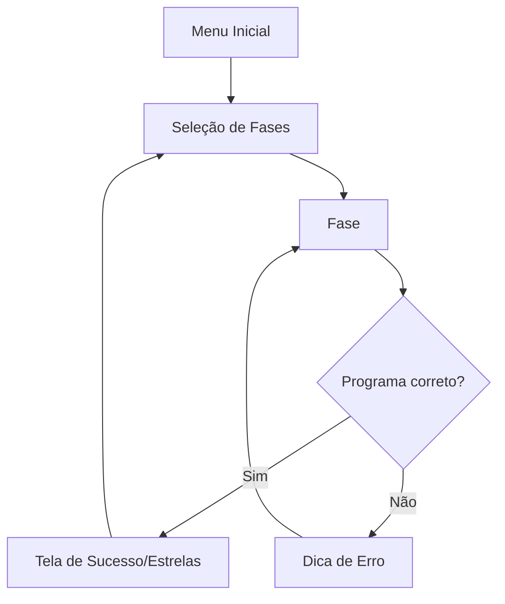
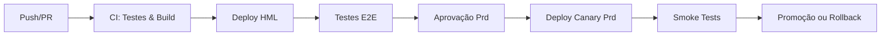

# GDD - Game Design Document: Bit a Bit
**Versão:** 0.1.0
**Data:** 2026-10-04

## Premissa e problema
Ajudar jovens iniciantes, que jogam em celulares e não têm conhecimento prévio de programação, a desenvolverem raciocínio lógico por meio de um jogo educacional.

## High concept
Um puzzle de programação minimalista onde você arrasta blocos lógicos para conduzir um robô até a saída, consumindo dados (bits) e aprendendo otimização.

## Gênero e plataforma
- **Gênero:** Puzzle / Lógica / Educacional
- **Plataforma:** Web Mobile e Desktop (Progressive Web App / HTML5)

## Mecânicas-core
- **Movimentação Baseada em Grade:** O robô navega num ambiente 2D (NxM).
- **Programação Visual:** O jogador não digita código, ele clica/toca em blocos na interface ("andar", "virar").
- **Execução Automática:** Uma vez montado o programa, o jogador dá "Play" e assiste à simulação.

## Enredo e personagens
O "Bit", um robô explorador simples (representado por um triângulo ou quadrado com olhos), perdeu-se na rede lógica e precisa coletar fragmentos de memória (chips) para achar a saída.

## Fluxo do jogo

## Level design
- **Fase 1:** Sequência linear simples (apenas andar).
- **Fase 2:** Curvas e coletas (andar, virar, pegar).
- **Fase 3-6:** Introdução de repetições e condicionais (futuro).

## UI/UX e acessibilidade
- Botões grandes com no mínimo 44x44px.
- Alto contraste entre elementos (fundo escuro, blocos em cores vibrantes).
- Resposta visual clara em caso de erro (robô bate e pisca).
- Acessível via teclado (Navegação por Tab).

## Áudio
- Efeitos sonoros minimalistas de bipes (sucesso, erro, passo). Sintetizados via Web Audio API.

## Arte e referências
- Estilo "Geometria minimalista". 
- Referências: Lightbot.

## Uso de IA e componentes de terceiros
- Uso da IA (Gemini) para arquitetura e lógica base (ver `AI-USAGE.md`).
- Vite e TypeScript para build.
- Vitest e Playwright para testes.

## Próximos passos
- Implementar fases 3 a 6.
- Adicionar sons.
- Melhorar partículas visuais.

## Esteira

Link do repositório: (Será preenchido após a criação no GitHub)
